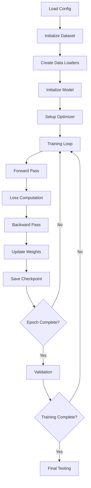
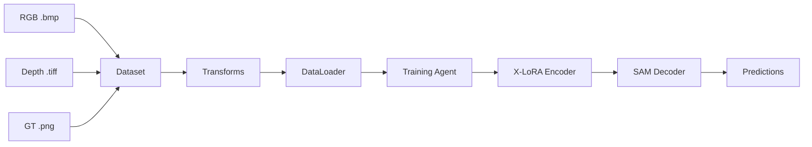

# Design Document

## Overview

This design implements a complete training and testing pipeline for the NEU-RSSDDS-AUG defect detection dataset using the MM-SAM framework. The solution extends the existing MM-SAM architecture to support a new RGB-D dataset with binary defect segmentation, maintaining compatibility with the original framework while adding dataset-specific functionality.

## Architecture

### High-Level Architecture

The system follows the MM-SAM's modular architecture with these key components:

1. **Dataset Module** (`NEURSSDDSDataset`): Custom dataset class for loading RGB-D defect detection data
2. **Training Agent** (`NEURSSDDSCMTransferSAM`): Specialized training agent extending the CM Transfer framework
3. **Configuration System**: YAML-based configuration for training parameters
4. **Checkpoint Management**: Automated saving and loading of model checkpoints
5. **Testing Pipeline**: Inference system with prediction generation and saving

### Data Flow

```
RGB Images (.bmp) + Depth Images (.tiff) + GT Masks (.png)
    ↓
NEURSSDDSDataset (preprocessing & augmentation)
    ↓
NEURSSDDSCMTransferSAM (training agent)
    ↓
X-LoRA Encoder (depth feature extraction)
    ↓
SAM Decoder (mask prediction)
    ↓
Binary Segmentation Output (defect=white, background=black)
```

## Components and Interfaces

### 1. Dataset Component (`mm_sam/datasets/neu_rssdds.py`)

**Purpose**: Handle loading and preprocessing of NEU-RSSDDS-AUG dataset

**Key Methods**:
- `__init__(data_dict, is_train, transforms)`: Initialize dataset with file paths
- `__getitem__(index)`: Load RGB, depth, and GT mask for a single sample
- `get_depth_by_path(depth_path)`: Load and preprocess .tiff depth images
- `collate_fn(batch)`: Batch processing for DataLoader

**Data Structure**:
```python
{
    "sample_001": {
        "image_path": "../datasets/NEU-RSDDS-AUG/Image_train/sample_001.bmp",
        "depth_path": "../datasets/NEU-RSDDS-AUG/Depth_train/sample_001.tiff", 
        "gt_mask_path": "../datasets/NEU-RSDDS-AUG/GT_train/sample_001.png"
    }
}
```

### 2. Training Agent (`mm_sam/train_agents/cm_transfer/neu_rssdds.py`)

**Purpose**: Orchestrate training process for NEU-RSSDDS dataset

**Key Methods**:
- `agent_init()`: Initialize model, optimizer, and datasets
- `train_step()`: Single training iteration with loss computation
- `preprocess_depth_images()`: Depth-specific preprocessing
- `model_state_dict()`: Extract model weights for checkpointing

**Configuration**:
- Inherits from `CMTransferSAM` base class
- Uses depth images as X-modality input (`x_data_field='depth_images'`)
- Single channel depth input (`x_channel_num=1`)

### 3. Configuration Files

**Training Config** (`config/cm_transfer/neu_rssdds_1gpu.yaml`):
```yaml
gpu_num: 1
train_epoch_num: 50
train_bs: 2
valid_bs: 4
test_bs: 1
train_agent: mm_sam.train_agents.cm_transfer.neu_rssdds.NEURSSDDSCMTransferSAM
agent_kwargs:
  train_transforms: cmtransfer_v1
  valid_transforms: resize_1024
  test_transforms: resize_1024
  x_lora_rank: 4
```

### 4. Data Loading Utilities

**File Structure Setup** (`pyscripts/neu_rssdds_setup.py`):
- Scan dataset directories for .bmp, .tiff, and .png files
- Generate train/test split dictionaries
- Create metadata files for dataset access

### 5. Testing and Inference Pipeline

**Testing Agent Extensions**:
- Load trained checkpoint from `/hy-tmp/output/checkpoint.pth`
- Process test images from `Image_test` and `Depth_test` directories
- Generate binary predictions (defect=255, background=0)
- Resize predictions to original image dimensions
- Save predictions to `/hy-tmp/output/predictions/` with original filenames

## Data Models

### Input Data Format

**RGB Images**:
- Format: .bmp files
- Expected size: Variable (will be resized to 1024x1024 for processing)
- Channels: 3 (RGB)
- Value range: 0-255

**Depth Images**:
- Format: .tiff files  
- Expected size: Same as corresponding RGB image
- Channels: 1 (single depth channel)
- Value range: Variable (will be normalized)

**Ground Truth Masks**:
- Format: .png files
- Expected size: Same as corresponding RGB image
- Channels: 1 (binary mask)
- Values: 0 (background), 255 (defect)

### Output Data Format

**Prediction Masks**:
- Format: .png files
- Size: Original image dimensions (resized from 1024x1024)
- Channels: 1 (binary mask)
- Values: 0 (background), 255 (defect)
- Naming: Original filename preserved

## Error Handling

### Dataset Loading Errors
- **Missing Files**: Validate all required files exist before training
- **Format Errors**: Handle corrupted .bmp/.tiff/.png files gracefully
- **Size Mismatches**: Ensure RGB, depth, and GT have consistent dimensions

### Training Errors
- **GPU Memory**: Implement batch size adjustment for OOM errors
- **Checkpoint Corruption**: Validate checkpoint integrity before loading
- **Path Errors**: Handle missing output directories by creating them

### Testing Errors
- **Missing Checkpoint**: Provide clear error message if checkpoint not found
- **Output Directory**: Create prediction output directory if it doesn't exist
- **Resize Failures**: Handle edge cases in prediction resizing

## Testing Strategy

### Unit Testing
- **Dataset Loading**: Test individual file loading functions
- **Data Preprocessing**: Validate transforms and normalization
- **Model Components**: Test X-encoder and decoder separately

### Integration Testing
- **End-to-End Training**: Test complete training pipeline with small dataset
- **Checkpoint Saving/Loading**: Verify checkpoint persistence and restoration
- **Prediction Generation**: Test inference pipeline with known inputs

### Performance Testing
- **Memory Usage**: Monitor GPU memory consumption during training
- **Training Speed**: Benchmark training time per epoch
- **Inference Speed**: Measure prediction generation time

### Development Testing
- **Random Data Generation**: Create synthetic RGB-D data for testing
- **CPU Fallback**: Ensure code works on CPU for development
- **Path Flexibility**: Support both `./hy-tmp` (dev) and `/hy-tmp` (prod) paths

## Implementation Considerations

### Environment Compatibility
- **Development Environment**: Use `./hy-tmp` paths and CPU device
- **Production Environment**: Use `/hy-tmp` paths and CUDA device
- **Path Management**: Centralized path configuration for easy switching

### Checkpoint Management
- **Overwrite Strategy**: Always save to same checkpoint file (`checkpoint.pth`)
- **Best Model Selection**: Use `mean_nonzero_fore_iu` metric for model selection
- **Checkpoint Content**: Include model state, optimizer state, and metadata

### Logging Strategy
- **Unified Logging**: All training and testing logs to `/hy-tmp/output/result.log`
- **Log Format**: Timestamp, level, component, and message
- **Progress Tracking**: Epoch progress, loss values, and evaluation metrics

### Memory Optimization
- **Batch Size**: Conservative batch sizes for single GPU training
- **Data Loading**: Efficient loading with appropriate number of workers
- **Model Precision**: Use mixed precision training if supported

## Mermaid Diagrams

### Training Pipeline Flow


### Data Loading Architecture
